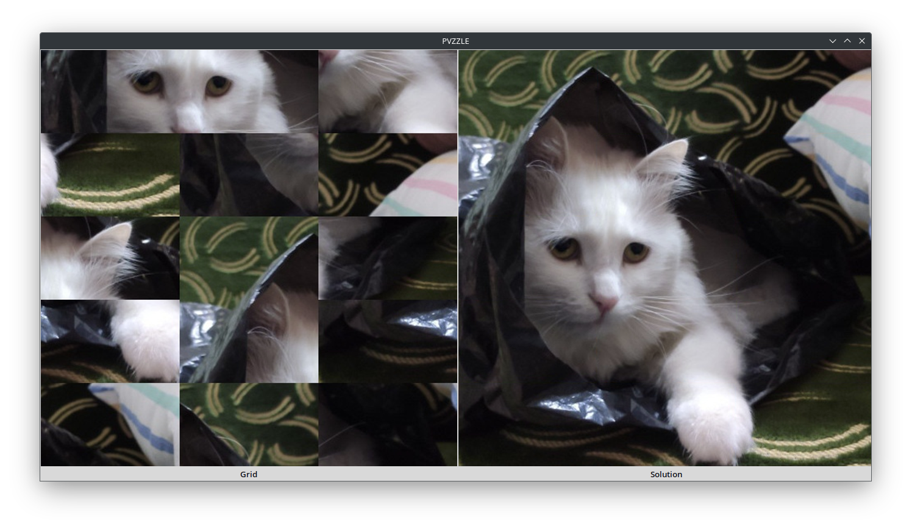

# pvzzle

An automatic puzzles solver.

## Supported puzzles types
- Grid puzzles with hint image (not neccesarly of the same size).
- Grid puzzles without hint image.
- Jigsaw puzzles with hint image (not neccesarly of the same size).

### Algorithms
Some types have several solving algorithms, they differ in implementation and some might give better answers than the rest, some are much faster.

## Usage
`python ./main.py`

## Screenshots

## License
[GPL-3-or-later](LICENSE)
